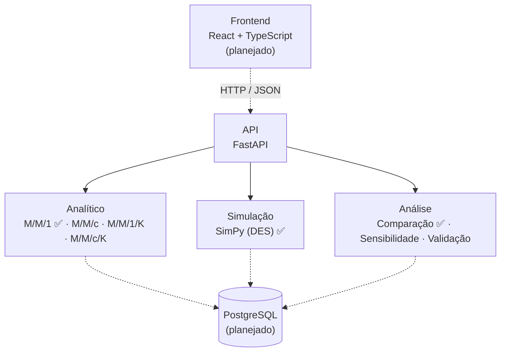

# QSimulador

> Laboratório interativo de modelagem, simulação e análise de sistemas de filas.


O **QSimulador** é uma ferramenta educacional e experimental para modelar, simular e analisar sistemas computacionais que apresentam comportamento de filas (servidores web, APIs, bancos de dados, serviços distribuídos).

Mais do que uma calculadora de teoria das filas, a proposta é uma **plataforma experimental** que integra, em um único fluxo, modelagem analítica, simulação de eventos discretos e análise de resultados.

## Status

O projeto está em desenvolvimento. O núcleo do modelo **M/M/1** e a API já funcionam; a interface web e os demais modelos estão planejados.

| Componente | Situação |
| --- | --- |
| Modelo analítico M/M/1 | ✅ Implementado |
| Simulação de eventos discretos M/M/1 (SimPy), com réplicas e intervalos de confiança | ✅ Implementado |
| API REST (`/calculate`, `/simulate` e `/compare`) | ✅ Implementado |
| Comparação analítico × simulação (erro relativo e verificação do intervalo de confiança) | ✅ Implementado (módulo, endpoint e script de demonstração) |
| Interface web (React + TypeScript) | 📋 Planejado |
| Modelos M/M/c, M/M/1/K e M/M/c/K | 📋 Planejado |
| Experimentos (varredura de parâmetros), importação do JMeter, persistência | 📋 Planejado |

---

## Sumário

- [Início rápido](#início-rápido)
- [Motivação](#motivação)
- [Funcionalidades](#funcionalidades)
- [Modelo M/M/1](#modelo-mm1)
- [Exemplo de uso](#exemplo-de-uso)
- [Arquitetura](#arquitetura)
- [Tecnologias](#tecnologias)
- [Estrutura do projeto](#estrutura-do-projeto)
- [API](#api)
- [Validação do software](#validação-do-software)
- [Validação com dados reais](#validação-com-dados-reais-planejado)
- [Princípios de desenvolvimento](#princípios-de-desenvolvimento)
- [Roadmap](#roadmap)
- [Contexto acadêmico](#contexto-acadêmico)
- [Licença](#licença)

---

## Início rápido

Requer Python 3.10 ou superior. A partir da raiz do repositório:

```bash
cd backend
python -m venv .venv
source .venv/bin/activate          # Windows (PowerShell): .venv\Scripts\Activate.ps1
pip install -r requirements-dev.txt

python -m pytest                   # roda os testes
python -m examples.mm1_demo        # compara analítico × simulação no terminal
python -m uvicorn app.main:app --reload   # sobe a API em http://127.0.0.1:8000/docs
```

O guia completo, com chamadas à API, uso em Python, interpretação dos resultados e solução de problemas, está em **[docs/como-executar.md](docs/como-executar.md)**.

## Motivação

Sistemas computacionais recebem requisições que precisam ser atendidas por recursos de capacidade limitada. Quando a taxa de chegada aumenta, surgem filas maiores, tempos de espera crescentes, utilização elevada dos recursos, aproximação da saturação e degradação do desempenho.

Uma ferramenta de modelagem permite estudar esses fenômenos de forma controlada, sem depender exclusivamente da execução de um sistema real.

## Funcionalidades

O QSimulador permite (ou permitirá) ao usuário:

1. definir um modelo de filas e informar seus parâmetros ✅
2. obter métricas analíticas ✅
3. executar uma simulação de eventos discretos com múltiplas replicações ✅
4. comparar resultados analíticos e simulados, com erro relativo ✅
5. realizar experimentos do tipo *"e se..."* (varredura de λ, μ e número de servidores) 📋
6. identificar regiões de alta utilização e aproximação da saturação 📋
7. visualizar resultados em tabelas e gráficos 📋
8. importar dados reais, por exemplo do Apache JMeter, e compará-los com o modelo e a simulação 📋

### Modelos de filas

| Modelo | Situação |
| --- | --- |
| M/M/1 | ✅ Implementado |
| M/M/c | 📋 Planejado |
| M/M/1/K | 📋 Planejado |
| M/M/c/K | 📋 Planejado |

Os modelos são implementados de forma modular, para que novos modelos possam ser adicionados sem alterar a interface ou o núcleo de simulação.

---

## Modelo M/M/1

Representa um sistema com chegadas segundo um processo de Poisson, tempos de serviço exponenciais, um único servidor, fila ilimitada e disciplina FIFO.

**Entrada:** taxa média de chegada $\lambda$, taxa média de serviço $\mu$, tempo de simulação e número de replicações.

Para $\lambda < \mu$, as métricas analíticas são:

| Métrica | Fórmula |
| --- | --- |
| Utilização $\rho$ | $\rho = \dfrac{\lambda}{\mu}$ |
| Nº médio no sistema $L$ | $L = \dfrac{\lambda}{\mu - \lambda}$ |
| Nº médio na fila $L_q$ | $L_q = \dfrac{\lambda^2}{\mu(\mu - \lambda)}$ |
| Tempo médio no sistema $W$ | $W = \dfrac{1}{\mu - \lambda}$ |
| Tempo médio na fila $W_q$ | $W_q = \dfrac{\lambda}{\mu(\mu - \lambda)}$ |

Se $\lambda \ge \mu$, o sistema não é estável e as métricas estacionárias não se aplicam. Nesse caso, a API e as funções devolvem um erro explícito, em vez de resultados enganosos:

```text
O modelo não está em condição estável.
Para M/M/1, é necessário que λ < μ.
```

### Simulação de eventos discretos

O motor de simulação representa a evolução temporal do sistema por eventos (chegada, início do atendimento, término do atendimento e saída) e é implementado com [SimPy](https://simpy.readthedocs.io/). Detalhes de implementação:

- **Réplicas independentes:** cada replicação usa um gerador aleatório próprio, derivado de uma única semente, o que torna o experimento reproduzível.
- **Médias no tempo:** $L$, $L_q$ e $\rho$ são médias ponderadas pelo tempo (integral do estado do sistema dividida pelo tempo observado). $W$ e $W_q$ são médias por cliente.
- **Warm-up:** o sistema começa vazio; um período inicial configurável é descartado para eliminar o transitório.
- **Intervalos de confiança:** calculados entre as replicações com a distribuição t de Student (nível padrão de 95%).
- **Saídas:** utilização observada, número médio de clientes no sistema e na fila, tempo médio no sistema, tempo médio de espera e vazão observada.

---

## Exemplo de uso

Resultado real do script de demonstração (`python -m examples.mm1_demo`), que usa o mesmo módulo do endpoint `/compare`, com $\lambda = 40$ req/s, $\mu = 50$ req/s, 2.000 s simulados por réplica, warm-up de 100 s, 10 replicações e semente 2026:

| Métrica | Analítico | Simulação | IC 95% | Erro relativo | Analítico no IC? |
| --- | ---: | ---: | --- | ---: | :---: |
| $\rho$ | 0,8000 | 0,7982 | [0,7952; 0,8012] | 0,22% | sim |
| $L$ | 4,0000 | 3,9634 | [3,8720; 4,0547] | 0,92% | sim |
| $L_q$ | 3,2000 | 3,1651 | [3,0761; 3,2541] | 1,09% | sim |
| $W$ | 0,1000 s | 0,0992 s | [0,0971; 0,1013] | 0,80% | sim |
| $W_q$ | 0,0800 s | 0,0792 s | [0,0771; 0,0813] | 0,97% | sim |

O valor analítico fica dentro do intervalo de confiança em todas as métricas, e a vazão observada (39,95 req/s) é praticamente igual a $\lambda$, como esperado em regime estável.

**Como ler o resultado.** Com 95% de confiança em cada uma das seis métricas comparadas (as cinco acima mais a vazão), é esperado que, de vez em quando, uma delas fique fora do intervalo apenas por acaso. Em 60 execuções com sementes de 0 a 59 ($\lambda = 1$, $\mu = 2$, 5.000 de tempo simulado, warm-up de 200, 10 réplicas), todas as métricas ficaram dentro do intervalo em 54 (90%), e cada métrica individualmente ficou entre 95% e 98%. Portanto, uma métrica isolada fora do intervalo não indica erro de implementação; um erro relativo alto e repetido entre sementes diferentes, sim.

---

## Arquitetura

O projeto é um **monólito modular**, com separação clara entre interface, API, modelos matemáticos, simulação e análise. As partes tracejadas ainda não foram implementadas.



A persistência (`Model`, `Experiment`, `SimulationRun`, `Metric`, `JMeterDataset`, `Comparison`) é opcional na primeira versão: o núcleo funciona sem banco de dados.

## Tecnologias

| Camada | Tecnologia | Situação |
| --- | --- | --- |
| Backend | Python + FastAPI | ✅ em uso |
| Simulação | SimPy | ✅ em uso |
| Computação científica | NumPy / SciPy | ✅ em uso |
| Testes | pytest | ✅ em uso |
| Frontend | React + TypeScript | 📋 planejado |
| Visualização | Plotly | 📋 planejado |
| Banco de dados | PostgreSQL | 📋 planejado |
| Testes do frontend | Vitest | 📋 planejado |
| Containerização | Docker | 📋 planejado |

## Estrutura do projeto

```text
qsimulador/
├── README.md
├── docs/
│   └── como-executar.md
└── backend/
    ├── requirements.txt
    ├── requirements-dev.txt
    ├── pytest.ini
    ├── examples/
    │   └── mm1_demo.py            # comparação analítico × simulação no terminal
    ├── app/
    │   ├── main.py                # aplicação FastAPI
    │   ├── api/                   # rotas, esquemas e tratamento de erros
    │   ├── analytical/
    │   │   └── mm1.py             # modelo analítico M/M/1
    │   ├── simulation/
    │   │   ├── mm1.py             # simulação M/M/1 com SimPy
    │   │   └── results.py         # estruturas de resultado
    │   ├── domain/
    │   │   ├── metrics/           # estrutura comum de métricas
    │   │   └── validation/        # validação de parâmetros e erros de domínio
    │   ├── experiments/           # (planejado)
    │   ├── analysis/
    │   │   └── comparison.py      # comparação analítico × simulação
    │   └── persistence/           # (planejado)
    └── tests/
```

Ainda planejados: `frontend/`, `docker/` e `docker-compose.yml`.

---

## API

Com o servidor no ar (`python -m uvicorn app.main:app --reload`), a documentação interativa fica em `http://127.0.0.1:8000/docs`.

| Método e rota | Descrição |
| --- | --- |
| `GET /api/health` | Verifica se a API está no ar |
| `POST /api/models/mm1/calculate` | Métricas analíticas do M/M/1 |
| `POST /api/models/mm1/simulate` | Simulação de eventos discretos com réplicas |
| `POST /api/models/mm1/compare` | Compara analítico × simulação, métrica a métrica |

### `POST /api/models/mm1/calculate`

```json
// Requisição
{ "lambda": 40, "mu": 50 }
```

```json
// Resposta
{ "model": "M/M/1", "rho": 0.8, "L": 4.0, "Lq": 3.2, "W": 0.1, "Wq": 0.08 }
```

### `POST /api/models/mm1/simulate`

```json
// Requisição (apenas lambda, mu e simulation_time são obrigatórios)
{
  "lambda": 40,
  "mu": 50,
  "simulation_time": 2000,
  "replications": 10,
  "warmup_time": 100,
  "seed": 2026,
  "confidence_level": 0.95
}
```

| Campo | Descrição | Padrão |
| --- | --- | --- |
| `replications` | Número de réplicas independentes | 10 |
| `warmup_time` | Período inicial descartado | 0 |
| `seed` | Semente aleatória; se omitida, uma é sorteada e devolvida | aleatória |
| `confidence_level` | Nível do intervalo de confiança | 0,95 |

```json
// Resposta (resumida)
{
  "model": "M/M/1",
  "lambda": 40.0,
  "mu": 50.0,
  "simulation_time": 2000.0,
  "warmup_time": 100.0,
  "replications": 10,
  "seed": 2026,
  "confidence_level": 0.95,
  "runs": [ { "index": 0, "rho": 0.7954, "L": 3.8132, "...": "..." } ],
  "summary": {
    "L": { "mean": 3.9634, "std": 0.1277, "ci_low": 3.8720, "ci_high": 4.0547, "n": 10 }
  }
}
```

O `summary` traz `rho`, `L`, `Lq`, `W`, `Wq` e `throughput`; `runs` traz as métricas de cada réplica.

### `POST /api/models/mm1/compare`

Roda o modelo analítico e a simulação com os mesmos parâmetros e compara os resultados. A requisição é idêntica à de `/simulate`.

```json
// Resposta (resumida; o objeto "metrics" traz rho, L, Lq, W, Wq e throughput)
{
  "model": "M/M/1",
  "lambda": 40.0,
  "mu": 50.0,
  "simulation_time": 2000.0,
  "warmup_time": 100.0,
  "replications": 10,
  "seed": 2026,
  "confidence_level": 0.95,
  "metrics": {
    "L": {
      "analytical": 4.0,
      "simulated_mean": 3.9634,
      "ci_low": 3.872,
      "ci_high": 4.0547,
      "absolute_error": 0.0366,
      "relative_error_pct": 0.9159,
      "within_ci": true
    }
  },
  "all_within_ci": true,
  "max_relative_error_pct": 1.0895
}
```

| Campo | Significado |
| --- | --- |
| `relative_error_pct` | Erro relativo da média simulada, em % do valor analítico |
| `within_ci` | O valor analítico está dentro do intervalo de confiança da simulação? É `null` com 1 réplica (não há intervalo) |
| `all_within_ci` | `true` se todas as métricas ficaram dentro do intervalo; `null` com 1 réplica |
| `max_relative_error_pct` | Maior erro relativo entre as métricas |

Para a vazão (`throughput`), o valor analítico de referência é $\lambda$, já que, em regime estável, a taxa de saída é igual à de chegada.

### Erros

Toda requisição inválida devolve HTTP 422 com `{"code", "message", "fields"?}`:

| `code` | Quando acontece |
| --- | --- |
| `unstable_system` | λ ≥ μ |
| `invalid_parameter` | Valor fora da regra (zero, negativo, warm-up ≥ tempo simulado, simulação grande demais) |
| `invalid_request` | Campo ausente ou do tipo errado (inclui a lista `fields`) |
| `insufficient_sample` | Tempo simulado tão curto que nenhum cliente foi medido |

---

## Validação do software

- **Testes matemáticos:** resultados comparados com casos conhecidos, calculados de forma independente, e verificação da Lei de Little ($L = \lambda W$ e $L_q = \lambda W_q$) e das relações $L = L_q + \rho$ e $W = W_q + 1/\mu$.
- **Testes unitários:** validação de parâmetros (zero, negativo, NaN, infinito, tipos inválidos, sistema instável).
- **Testes do motor de simulação:** casos determinísticos com resposta exata (por exemplo, chegadas a cada 1,0 e serviço de 0,5), crescimento da fila em sistema sobrecarregado e efeito do warm-up.
- **Concordância estatística:** a simulação é comparada com o modelo analítico, com tolerâncias calibradas pela variação observada entre sementes; em testes de cobertura, os intervalos de 95% contiveram o valor analítico na proporção esperada.
- **Reprodutibilidade:** a mesma semente produz resultados idênticos; réplicas diferentes são independentes.
- **Testes da comparação:** erro relativo e verificação do intervalo (limites inclusivos, ausência de intervalo com 1 réplica) com dados sintéticos de resposta conhecida, e consistência entre o módulo de comparação, o modelo analítico e a simulação.
- **Testes da API:** casos de sucesso, cada tipo de erro e a documentação OpenAPI.

Para executar: `python -m pytest` (dentro de `backend/`).

## Validação com dados reais (planejado)

O objetivo final do projeto é fechar o ciclo **modelo analítico × simulação × medição**: dados reais (por exemplo, exportados do Apache JMeter em CSV) serão comparados com o modelo e a simulação, com cálculo do erro relativo:

$$
\text{erro relativo} = \frac{|\,valor_{simulado} - valor_{observado}\,|}{valor_{observado}} \times 100
$$

Formato de CSV previsto:

```text
users,avg_ms,p90_ms,throughput,error_rate
```

**Limitação a considerar.** O M/M/1 é um modelo de sistema *aberto*: as chegadas ocorrem a uma taxa $\lambda$ independente do estado do sistema. Já um teste de carga com $N$ usuários simultâneos se comporta como um sistema *fechado*, porque cada usuário só envia a próxima requisição depois de receber a resposta. Por isso:

- o $\lambda$ a comparar com o modelo deve ser estimado a partir do *throughput* medido (ou controlado, com um timer de vazão constante no JMeter);
- a latência medida inclui rede e outros componentes que o M/M/1 não representa;
- divergências entre modelo e medição podem vir dessa diferença estrutural, e não de erro de implementação. Um modelo de população finita (M/M/1//N) é uma extensão natural.

---

## Princípios de desenvolvimento

- **Separação de responsabilidades:** a interface não contém fórmulas matemáticas nem lógica de simulação.
- **Reprodutibilidade:** experimentos simulados aceitam uma semente aleatória configurável.
- **Testabilidade:** modelos analíticos e componentes de simulação são testáveis independentemente da interface.
- **Extensibilidade:** novos modelos não exigem alterações estruturais extensas.
- **Transparência:** a ferramenta explicita as hipóteses do modelo e indica se um resultado é analítico, simulado ou experimental.
- **Núcleo antes da interface:** o modelo matemático é validado antes de se construir qualquer interface sobre ele.

---

## Roadmap

- [x] **Fase 1 — Núcleo matemático:** estrutura do backend, modelo M/M/1, cálculo de ρ, L, Lq, W e Wq, validação de parâmetros e testes.
- [x] **Fase 2 — Simulação:** integração com SimPy, chegadas e serviços exponenciais, fila e servidor, coleta de métricas, réplicas, warm-up, intervalos de confiança e endpoints da API.
- [ ] **Fase 3 — Interface:** React + TypeScript, seleção do modelo, formulário de parâmetros, painel de métricas e gráficos.
- [x] **Fase 4 — Comparação:** módulo e endpoint de comparação analítico × simulação, com erro absoluto, erro relativo e verificação do intervalo de confiança. Os gráficos comparativos virão com a interface (Fase 3).
- [ ] **Fase 5 — Novos modelos:** M/M/c, M/M/1/K e M/M/c/K.
- [ ] **Fase 6 — Experimentação:** varredura de λ e μ, comparação de servidores e análise de sensibilidade.
- [ ] **Fase 7 — Dados reais:** importação de CSV e de resultados do JMeter, comparação com o modelo e relatórios experimentais.
- [ ] **Fase 8 — Persistência e publicação:** PostgreSQL, Docker, deploy e documentação acadêmica.

### Possíveis extensões

Capacidade finita, múltiplos servidores, outras disciplinas de atendimento, distribuições além da exponencial, redes de filas, modelos de população finita, análise de estado estacionário e transiente, e geração automática de relatórios. Essas extensões só serão implementadas após a validação do núcleo inicial.

---

## Contexto acadêmico

O QSimulador foi concebido no contexto da disciplina **Modelagem e Simulação de Sistemas Computacionais**, com foco em desempenho, teoria das filas, simulação de eventos discretos e análise experimental. O fluxo adotado segue as etapas clássicas de um estudo de simulação:

```text
Problema → Abstração → Modelo matemático → Implementação
        → Simulação → Experimento → Análise → Validação
```

## Licença

A licença será definida posteriormente, de acordo com os requisitos da disciplina e da equipe de desenvolvimento.
