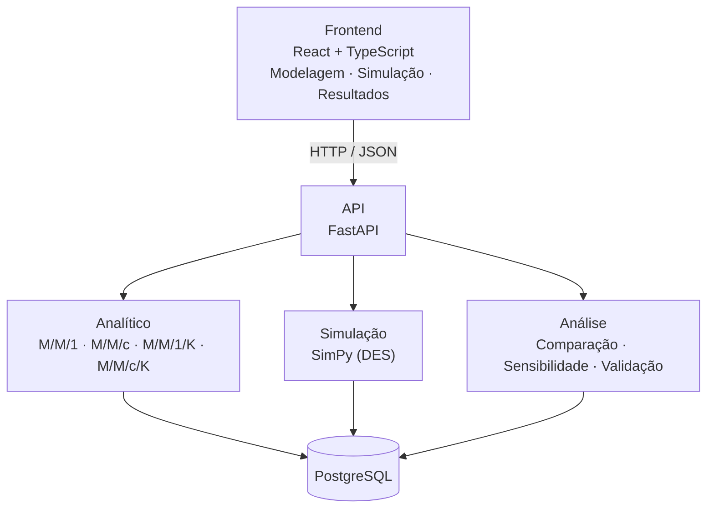

# QSimulador

> Laboratório interativo de modelagem, simulação e análise de sistemas de filas.


O **QSimulador** é uma ferramenta educacional e experimental para modelar, simular e analisar sistemas computacionais que apresentam comportamento de filas (servidores web, APIs, bancos de dados, serviços distribuídos).

Mais do que uma calculadora de teoria das filas, a proposta é uma **plataforma experimental** que integra, em um único fluxo, modelagem analítica, simulação de eventos discretos e análise de resultados.

> **Status:** em desenvolvimento — fase de definição arquitetural e especificação. A primeira versão cobrirá o modelo **M/M/1** e **M/M/c** com cálculo analítico, simulação de eventos discretos e comparação entre os dois.

---

## Sumário

- [Motivação](#motivação)
- [Funcionalidades](#funcionalidades)
- [Modelo M/M/1](#modelo-mm1)
- [Exemplo de uso](#exemplo-de-uso)
- [Arquitetura](#arquitetura)
- [Tecnologias](#tecnologias)
- [Estrutura do projeto](#estrutura-do-projeto)
- [API](#api)
- [Validação do software](#validação-do-software)
- [Princípios de desenvolvimento](#princípios-de-desenvolvimento)
- [Roadmap](#roadmap)
- [Contexto acadêmico](#contexto-acadêmico)
- [Licença](#licença)

---

## Motivação

Sistemas computacionais recebem requisições que precisam ser atendidas por recursos de capacidade limitada. Quando a taxa de chegada aumenta, surgem filas maiores, tempos de espera crescentes, utilização elevada dos recursos, aproximação da saturação e degradação do desempenho.

Uma ferramenta de modelagem permite estudar esses fenômenos de forma controlada, sem depender exclusivamente da execução de um sistema real.

## Funcionalidades

O QSimulador permite ao usuário:

1. definir um modelo de filas e informar seus parâmetros;
2. obter métricas analíticas;
3. executar uma simulação de eventos discretos com múltiplas replicações;
4. comparar resultados analíticos e simulados (com erro relativo);
5. realizar experimentos do tipo *"e se..."* (varredura de λ, μ e número de servidores);
6. identificar regiões de alta utilização e aproximação da saturação;
7. visualizar resultados em tabelas e gráficos;
8. *(planejado)* importar dados reais, por exemplo do Apache JMeter, e compará-los com o modelo e a simulação.

### Modelos de filas

| Modelo   | Situação        |
| -------- | --------------- |
| M/M/1    | versão inicial  |
| M/M/c    | versão inicial  |
| M/M/1/K  | planejado       |
| M/M/c/K  | planejado       |

Os modelos são implementados de forma modular, para que novos modelos possam ser adicionados sem alterar a interface ou o núcleo de simulação.

---

## Modelo M/M/1

Representa um sistema com chegadas segundo um processo de Poisson, tempos de serviço exponenciais, um único servidor, fila potencialmente ilimitada e disciplina FIFO.

**Entrada:** taxa média de chegada $\lambda$, taxa média de serviço $\mu$, tempo de simulação e número de replicações.

Para $\lambda < \mu$, as métricas analíticas são:

| Métrica                          | Fórmula                                  |
| -------------------------------- | ---------------------------------------- |
| Utilização $\rho$                | $\rho = \dfrac{\lambda}{\mu}$            |
| Nº médio no sistema $L$          | $L = \dfrac{\lambda}{\mu - \lambda}$     |
| Nº médio na fila $L_q$           | $L_q = \dfrac{\lambda^2}{\mu(\mu - \lambda)}$ |
| Tempo médio no sistema $W$       | $W = \dfrac{1}{\mu - \lambda}$           |
| Tempo médio na fila $W_q$        | $W_q = \dfrac{\lambda}{\mu(\mu - \lambda)}$ |

Se $\lambda \ge \mu$, o sistema não é estável e as métricas estacionárias não se aplicam. Nesse caso, a interface exibe uma mensagem clara em vez de resultados enganosos:

```text
O modelo não está em condição estável.
Para M/M/1, é necessário que λ < μ.
```

### Simulação de eventos discretos

O motor de simulação representa a evolução temporal do sistema por eventos (chegada, início do atendimento, término do atendimento e saída) e é implementado com [SimPy](https://simpy.readthedocs.io/). As saídas incluem utilização observada, número médio de clientes, tamanho médio da fila, tempo médio no sistema, tempo médio de espera e vazão observada.

---

## Exemplo de uso

**1. Parâmetros:** M/M/1, com $\lambda = 40$ req/s e $\mu = 50$ req/s.

**2. Resultado analítico:**

```text
ρ  = 0,80
L  = 4,00
Lq = 3,20
W  = 0,10 s
Wq = 0,08 s
```

**3. Simulação:** 10.000 s de tempo simulado, 10 replicações.

**4. Comparação** *(valores ilustrativos)*:

| Métrica | Analítico | Simulação |
| ------- | --------: | --------: |
| ρ       |      0,80 |      0,79 |
| L       |      4,00 |      4,12 |
| Lq      |      3,20 |      3,28 |
| W       |    0,10 s |   0,103 s |
| Wq      |    0,08 s |   0,082 s |

**5. Experimento:** variar $\lambda$ de 40 até 60 e observar como as métricas crescem à medida que o sistema se aproxima da saturação.

---

## Arquitetura

O projeto começa como um **monólito modular**, com separação clara entre interface, API, modelos matemáticos, simulação e análise.



## Tecnologias

| Camada                | Tecnologia      |
| --------------------- | --------------- |
| Frontend              | React + TypeScript |
| Backend               | FastAPI (Python) |
| Simulação             | SimPy           |
| Computação científica | NumPy / SciPy   |
| Visualização          | Plotly          |
| Banco de dados        | PostgreSQL      |
| Testes                | pytest (backend), Vitest (frontend) |
| Containerização       | Docker          |
| Controle de versão    | Git / GitHub    |

## Estrutura do projeto

Estrutura inicial proposta:

```text
queuelab/
├── frontend/
│   ├── src/
│   │   ├── components/
│   │   ├── pages/
│   │   ├── services/
│   │   ├── types/
│   │   └── charts/
│   └── package.json
├── backend/
│   ├── app/
│   │   ├── api/
│   │   ├── domain/
│   │   │   ├── models/
│   │   │   ├── metrics/
│   │   │   └── validation/
│   │   ├── analytical/
│   │   ├── simulation/
│   │   ├── experiments/
│   │   ├── analysis/
│   │   └── persistence/
│   ├── tests/
│   └── requirements.txt
├── docs/
├── docker/
├── docker-compose.yml
└── README.md
```

---

## API

Os endpoints são separados por responsabilidade. Exemplos iniciais:

### `POST /api/models/mm1/calculate`

Calcula as métricas analíticas do modelo M/M/1.

```json
// Requisição
{ "lambda": 40, "mu": 50 }
```

```json
// Resposta
{
  "model": "M/M/1",
  "rho": 0.8,
  "L": 4.0,
  "Lq": 3.2,
  "W": 0.1,
  "Wq": 0.08
}
```

### `POST /api/models/mm1/simulate`

Executa a simulação de eventos discretos.

```json
// Requisição
{
  "lambda": 40,
  "mu": 50,
  "simulation_time": 10000,
  "replications": 10
}
```

---

## Validação do software

- **Testes matemáticos:** resultados comparados com casos conhecidos, calculados de forma independente.
- **Testes unitários:** cada função de cálculo possui testes específicos (por exemplo, `test_mm1_metrics`, `test_invalid_lambda`, `test_unstable_system`).
- **Testes de simulação:** geração de chegadas e tempos de serviço, atendimento, fila e coleta de métricas.
- **Testes de integração:** fluxo Frontend → API → Modelo → Resultado.
- **Validação experimental:** Modelo → Simulação → Sistema real, quando aplicável.

Para comparação com dados reais, o erro relativo é calculado como:

$$
\text{erro relativo} = \frac{|\,valor_{simulado} - valor_{observado}\,|}{valor_{observado}} \times 100
$$

## Princípios de desenvolvimento

- **Separação de responsabilidades:** a interface não contém fórmulas matemáticas nem lógica de simulação.
- **Reprodutibilidade:** experimentos simulados aceitam uma semente aleatória configurável.
- **Testabilidade:** modelos analíticos e componentes de simulação são testáveis independentemente da interface.
- **Extensibilidade:** novos modelos não exigem alterações estruturais extensas.
- **Transparência:** a ferramenta explicita as hipóteses do modelo e indica se um resultado é analítico, simulado ou experimental.

---

## Roadmap

- [ ] **Fase 1 — Núcleo matemático:** estrutura do backend, modelo M/M/1, cálculo de ρ, L, Lq, W e Wq, testes unitários e validação.
- [ ] **Fase 2 — Simulação:** integração com SimPy, modelos de chegada e serviço, fila, servidor, coleta de métricas e replicações.
- [ ] **Fase 3 — Interface:** React + TypeScript, seleção do modelo, formulário de parâmetros, painel de métricas e gráficos.
- [ ] **Fase 4 — Comparação:** analítico × simulação, erro relativo e gráficos comparativos.
- [ ] **Fase 5 — Novos modelos:** M/M/c, M/M/1/K e M/M/c/K.
- [ ] **Fase 6 — Experimentação:** varredura de λ e μ, comparação de servidores e análise de sensibilidade.
- [ ] **Fase 7 — Dados reais:** importação de CSV e de resultados do JMeter, comparação com o modelo e relatórios experimentais.
- [ ] **Fase 8 — Persistência e publicação:** PostgreSQL, Docker, documentação da API, deploy e documentação acadêmica.

### Possíveis extensões

Capacidade finita, múltiplos servidores, outras disciplinas de atendimento, distribuições além da exponencial, redes de filas, análise de estado estacionário e transiente, e geração automática de relatórios. Essas extensões só serão implementadas após a validação do núcleo inicial.

---

## Contexto acadêmico

O QueueLab foi concebido no contexto da disciplina **Modelagem e Simulação de Sistemas Computacionais**, com foco em desempenho, teoria das filas, simulação de eventos discretos e análise experimental. O fluxo adotado segue as etapas clássicas de um estudo de simulação:

```text
Problema → Abstração → Modelo matemático → Implementação
        → Simulação → Experimento → Análise → Validação
```

## Licença

A licença será definida posteriormente, de acordo com os requisitos da disciplina e da equipe de desenvolvimento.
