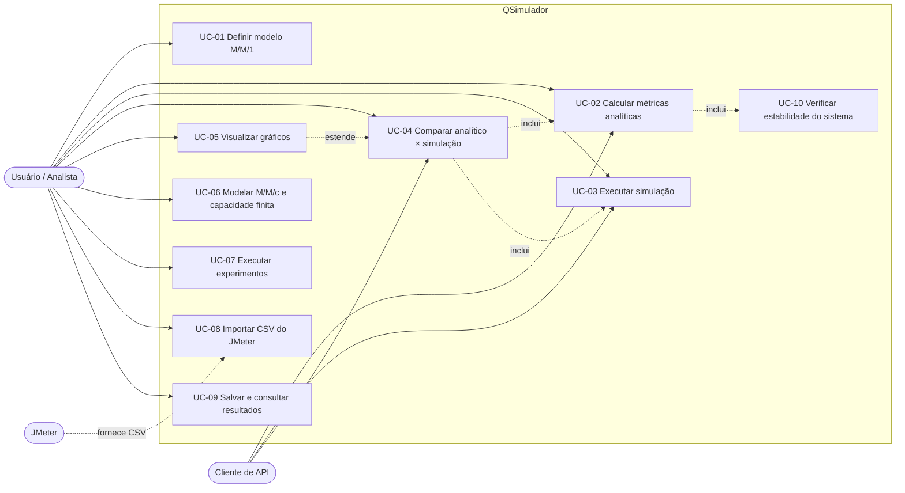

# Casos de Uso — QSimulador

Laboratório interativo de modelagem, simulação e análise de sistemas de filas, desenvolvido para a disciplina **Modelagem e Simulação de Sistemas Computacionais**.

Este documento descreve **quem usa o sistema, o que consegue fazer e como cada interação acontece**. Para instruções de execução, veja [`como-executar.md`](como-executar.md).

---

## 1. Atores

| Ator | Descrição |
|------|-----------|
| **Usuário (Analista)** | Estudante, professor ou pesquisador que modela um sistema de filas, simula e analisa resultados. É o ator principal. |
| **Cliente de API** | Script, ferramenta ou o frontend React que consome a API REST (FastAPI) diretamente. |
| **JMeter** *(externo, futuro)* | Ferramenta de teste de carga cujo CSV de resultados é importado para comparação com o modelo. |
| **Banco de dados** *(sistema, futuro)* | PostgreSQL, usado para persistir modelos, experimentos e resultados. |

---

## 2. Status de implementação

| Símbolo | Significado |
|---------|-------------|
| ✅ | Implementado e testado |
| 🚧 | Em desenvolvimento (etapa atual) |
| 📋 | Planejado no roadmap |

---

## 3. Visão geral dos casos de uso

### Resumo

| ID | Caso de uso | Ator principal | Status |
|----|-------------|----------------|--------|
| UC-01 | Definir parâmetros do modelo M/M/1 | Usuário | ✅ |
| UC-02 | Calcular métricas analíticas | Usuário, Cliente de API | ✅ |
| UC-03 | Executar simulação de eventos discretos | Usuário, Cliente de API | ✅ |
| UC-04 | Comparar resultado analítico × simulação | Usuário, Cliente de API | ✅ |
| UC-05 | Visualizar resultados em gráficos | Usuário | ✅ |
| UC-06 | Modelar M/M/c, M/M/1/K e M/M/c/K | Usuário | ✅ |
| UC-07 | Executar experimentos (varredura de parâmetros) | Usuário | 📋 |
| UC-08 | Importar CSV do JMeter e comparar com o modelo | Usuário | 📋 |
| UC-09 | Salvar e consultar modelos e resultados | Usuário | 📋 |
| UC-10 | Verificar estabilidade do sistema | Sistema (incluído) | ✅ |

> **Conferência de 08/10/2026:** os casos de uso implementados (UC-01 a UC-06 e UC-10) foram verificados executando o sistema. As divergências encontradas na auditoria em UC-02 (P0 não retornado), UC-03 (a simulação aceitava 1 réplica) e UC-04 (P0 simulado) foram fechadas. Os detalhes estão na seção 11 de [`requisitos-do-sistema.md`](requisitos-do-sistema.md).

---

## 4. Especificação dos casos de uso

### UC-01 — Definir parâmetros do modelo M/M/1 ✅

| Campo | Descrição |
|-------|-----------|
| **Ator principal** | Usuário |
| **Objetivo** | Informar a taxa de chegada (λ) e a taxa de serviço (μ) do sistema a ser analisado. |
| **Pré-condições** | Nenhuma. |
| **Pós-condições** | Parâmetros validados e prontos para análise ou simulação. |

**Fluxo principal**
1. O usuário informa a taxa de chegada **λ** (clientes por unidade de tempo).
2. O usuário informa a taxa de serviço **μ** (clientes atendidos por unidade de tempo).
3. O sistema valida que λ > 0 e μ > 0.
4. O sistema aceita os parâmetros.

**Fluxos alternativos**
- **3a.** Valor ausente, não numérico, zero ou negativo → o sistema rejeita a requisição e informa qual campo é inválido.

**Regras de negócio**
- RN-01: λ e μ devem ser números reais estritamente positivos.

---

### UC-02 — Calcular métricas analíticas ✅

| Campo | Descrição |
|-------|-----------|
| **Ator principal** | Usuário, Cliente de API |
| **Objetivo** | Obter as métricas teóricas exatas do modelo M/M/1. |
| **Pré-condições** | Parâmetros válidos (UC-01). |
| **Pós-condições** | Métricas analíticas retornadas. |

**Fluxo principal**
1. O usuário solicita o cálculo analítico com λ e μ.
2. O sistema verifica a estabilidade do sistema (UC-10).
3. O sistema calcula as métricas: utilização (ρ), número médio no sistema (L), número médio na fila (Lq), tempo médio no sistema (W), tempo médio na fila (Wq) e probabilidade de sistema vazio (P0).
4. O sistema retorna as métricas.

**Fluxos alternativos**
- **2a.** Sistema instável (ρ ≥ 1) → o sistema informa que não existe regime estacionário e não retorna métricas médias.

**Regras de negócio**
- RN-02: as métricas são calculadas por fórmulas fechadas e devem satisfazer a **Lei de Little** (L = λW e Lq = λWq).

---

### UC-03 — Executar simulação de eventos discretos ✅

| Campo | Descrição |
|-------|-----------|
| **Ator principal** | Usuário, Cliente de API |
| **Objetivo** | Estimar as métricas do sistema por simulação (SimPy) com réplicas independentes. |
| **Pré-condições** | Parâmetros válidos (UC-01). |
| **Pós-condições** | Estimativas das métricas com intervalo de confiança retornadas. |

**Fluxo principal**
1. O usuário informa λ, μ e os parâmetros de simulação (duração, número de réplicas, semente, período de aquecimento).
2. O sistema executa as réplicas independentes com SimPy.
3. O sistema descarta o período de aquecimento e calcula as métricas de cada réplica.
4. O sistema agrega as réplicas e calcula média e **intervalo de confiança** de cada métrica.
5. O sistema retorna os resultados.

**Fluxos alternativos**
- **1a.** Parâmetros de simulação inválidos (ex.: número de réplicas menor que 2) → o sistema rejeita e informa o erro.
- **2a.** Mesma semente informada → o sistema produz resultados reproduzíveis.

**Regras de negócio**
- RN-03: cada réplica usa um fluxo de números aleatórios independente, derivado da semente.
- RN-04: o intervalo de confiança é calculado a partir da variação entre réplicas.

---

### UC-04 — Comparar resultado analítico × simulação ✅

| Campo | Descrição |
|-------|-----------|
| **Ator principal** | Usuário, Cliente de API |
| **Objetivo** | Validar a simulação contra o modelo teórico e quantificar a diferença. |
| **Pré-condições** | Sistema estável (ρ < 1) e parâmetros válidos. |
| **Pós-condições** | Comparação por métrica retornada. |

**Fluxo principal**
1. O usuário informa λ, μ e os parâmetros de simulação.
2. O sistema executa o cálculo analítico (UC-02).
3. O sistema executa a simulação (UC-03).
4. Para cada métrica, o sistema calcula o **erro relativo** entre o valor analítico e a média simulada.
5. O sistema indica se o valor analítico **cai dentro do intervalo de confiança** da simulação.
6. O sistema retorna a comparação consolidada.

**Fluxos alternativos**
- **2a.** Sistema instável → a comparação é recusada, pois não há valor analítico de referência.

**Regras de negócio**
- RN-05: erro relativo = |simulado − analítico| / |analítico|.
- RN-06: um valor analítico fora do IC sinaliza possível problema de calibração (duração curta, aquecimento insuficiente ou poucas réplicas).

---

### UC-05 — Visualizar resultados em gráficos ✅

| Campo | Descrição |
|-------|-----------|
| **Ator principal** | Usuário |
| **Objetivo** | Interpretar visualmente os resultados e a comparação. |
| **Pré-condições** | Resultado de comparação disponível (UC-04). |
| **Pós-condições** | Gráficos exibidos na interface web. |

**Fluxo principal**
1. O usuário preenche λ e μ no formulário da interface web (React).
2. O usuário aciona a análise.
3. O sistema obtém a comparação pela API (UC-04).
4. O sistema exibe gráficos (Plotly) com os valores analíticos, as médias simuladas e os intervalos de confiança de cada métrica.

**Fluxos alternativos**
- **3a.** Erro de validação ou sistema instável → a interface exibe mensagem clara e não renderiza gráficos.

---

### UC-06 — Modelar M/M/c, M/M/1/K e M/M/c/K ✅

| Campo | Descrição |
|-------|-----------|
| **Ator principal** | Usuário |
| **Objetivo** | Analisar sistemas com múltiplos servidores e/ou capacidade finita. |
| **Pré-condições** | Parâmetros válidos, incluindo número de servidores (c) e/ou capacidade (K). |
| **Pós-condições** | Métricas analíticas e simuladas para o modelo escolhido. |

**Fluxo principal**
1. O usuário escolhe o tipo de modelo (M/M/1, M/M/c, M/M/1/K ou M/M/c/K).
2. O usuário informa λ, μ e, conforme o modelo, c e/ou K.
3. O sistema calcula as métricas analíticas e executa a simulação.
4. Para modelos com capacidade finita, o sistema inclui a **probabilidade de bloqueio**.
5. O sistema retorna e compara os resultados.

---

### UC-07 — Executar experimentos (varredura de parâmetros) 📋

| Campo | Descrição |
|-------|-----------|
| **Ator principal** | Usuário |
| **Objetivo** | Observar como as métricas variam ao alterar um parâmetro (ex.: utilização). |
| **Pré-condições** | Modelo definido. |
| **Pós-condições** | Série de resultados por valor de parâmetro. |

**Fluxo principal**
1. O usuário escolhe o parâmetro a variar e define a faixa e o passo.
2. O sistema executa análise e simulação para cada valor da faixa.
3. O sistema consolida os resultados em uma tabela e em gráficos de tendência.

**Fluxos alternativos**
- **2a.** Valores da faixa que tornam o sistema instável são sinalizados e tratados sem interromper o experimento.

---

### UC-08 — Importar CSV do JMeter e comparar com o modelo 📋

| Campo | Descrição |
|-------|-----------|
| **Ator principal** | Usuário |
| **Ator secundário** | JMeter |
| **Objetivo** | Confrontar medições de um sistema real com as previsões do modelo. |
| **Pré-condições** | Arquivo CSV exportado do JMeter. |
| **Pós-condições** | Métricas empíricas calculadas e comparadas com o modelo. |

**Fluxo principal**
1. O usuário envia o arquivo CSV.
2. O sistema valida o formato e extrai tempos de resposta e vazão.
3. O sistema calcula as métricas empíricas.
4. O sistema compara as métricas empíricas com as do modelo escolhido.

**Fluxos alternativos**
- **2a.** CSV malformado ou sem as colunas esperadas → o sistema informa o problema e rejeita o arquivo.

**Regras de negócio**
- RN-07: testes do JMeter geralmente geram **sistema fechado** (número fixo de usuários), diferente do M/M/1 aberto; o sistema deve alertar sobre essa diferença e considerar o modelo M/M/1//N.

---

### UC-09 — Salvar e consultar modelos e resultados 📋

| Campo | Descrição |
|-------|-----------|
| **Ator principal** | Usuário |
| **Ator secundário** | Banco de dados |
| **Objetivo** | Guardar modelos, simulações e experimentos para consulta posterior. |
| **Pré-condições** | Resultado disponível para salvar. |
| **Pós-condições** | Registro persistido e recuperável. |

**Fluxo principal**
1. O usuário escolhe salvar um modelo ou resultado.
2. O sistema persiste os dados no PostgreSQL.
3. O usuário consulta o histórico e reabre um registro salvo.

---

### UC-10 — Verificar estabilidade do sistema ✅

| Campo | Descrição |
|-------|-----------|
| **Ator principal** | Sistema (caso de uso incluído por UC-02 e UC-04) |
| **Objetivo** | Garantir que as métricas de regime estacionário só sejam calculadas quando existem. |

**Fluxo principal**
1. O sistema calcula a utilização ρ = λ/μ.
2. Se ρ < 1, o sistema libera o cálculo.

**Fluxos alternativos**
- **2a.** Se ρ ≥ 1, o sistema interrompe o cálculo e informa que a fila cresce indefinidamente.

---

## 5. Rastreabilidade

| Caso de uso | Fase do roadmap | Componentes principais |
|-------------|-----------------|------------------------|
| UC-01, UC-02, UC-10 | Fase 1 — M/M/1 analítico | Módulo analítico (NumPy/SciPy), API FastAPI |
| UC-03 | Fase 2 — Simulação | SimPy, API FastAPI |
| UC-04 | Fase 4 — Comparação | Módulo e endpoint de comparação |
| UC-05 | Fase 3 — Frontend | React + TypeScript, Plotly (requer CORS) |
| UC-06 | Fase 5 — Novos modelos | M/M/c, M/M/1/K, M/M/c/K |
| UC-07 | Fase 6 — Experimentos | Módulo de experimentos |
| UC-08 | Fase 7 — JMeter | Importador de CSV |
| UC-09 | Fase 8 — Persistência e deploy | PostgreSQL, Docker |

---

## 6. Requisitos transversais aos casos de uso

- **Reprodutibilidade:** simulações com a mesma semente devem gerar os mesmos resultados.
- **Validação de entrada:** toda entrada inválida deve gerar mensagem clara e identificar o campo.
- **Qualidade:** testes determinísticos com resposta exata, tolerâncias estatísticas calibradas pela variação entre sementes e verificação da Lei de Little.
- **Arquitetura:** monólito modular, executável localmente e via Docker.
